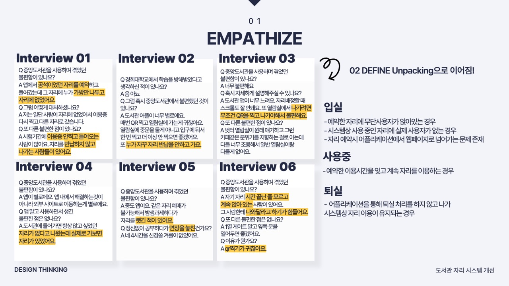
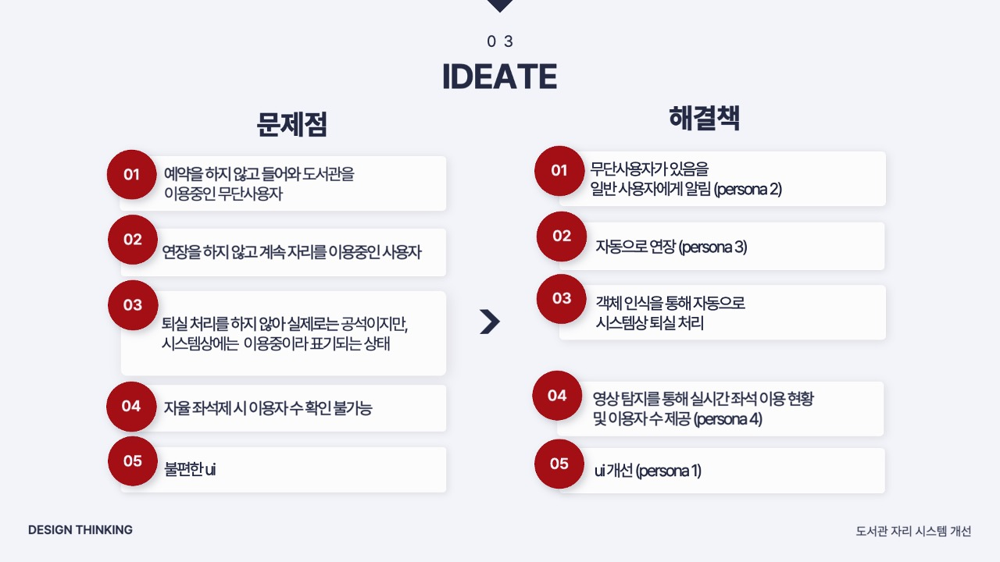

# LibSeatTrackerAI

## About Project







## Getting Started

Follow these steps to run the project locally:

1. **Start the backend server:**
   ```bash
   uvicorn backend.server:app --host 0.0.0.0 --port 8000
   ```

2. **Start the admin frontend:**
   ```bash
   streamlit run frontend/admin/admin_interface.py --server.port 8501
   ```

3. **Start the user frontend:**
   ```bash
   streamlit run frontend/user/user_interface.py --server.port 8502
   ```
